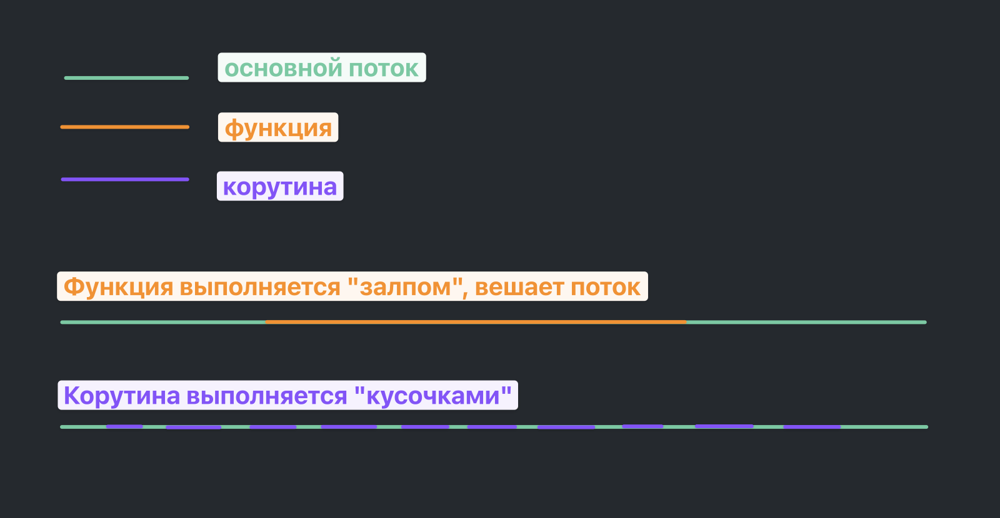
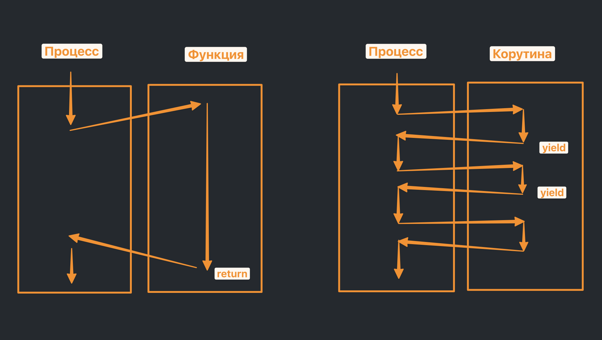

# Корутины в Lua с примерами



Корутины это что-то вроде потоков, но при этом они все равно ими не являются. Поток, это когда (например) на отдельное ядро процессора можно повесить полностью отдельную задачу, а корутина это когда блоки кода работают по очереди и могут быть остановлены в любом моменте, чтобы продолжить исполнение другого кода.

Вот несколько наглядных практических примеров использования корутин:

<!--truncate-->

## Пример 1. "Сглаживание" нагрузки тяжелых функций



Все функции в Lua выполняются последовательно. Корутины позволяют сделать некую "перемешку" выполняемых задач, что полезно, когда необходимо, например, на каждом игроке выполнить тяжелую функцию, но при этом не на всех сразу, чтобы сгладить процесс. После выполнения функции на одном игроке, корутина позволит выполнить остальную часть кода до следующего "тика". Затем она выполнит функцию на втором игроке, после чего снова выполнится весь остальной код.

Предположим, у нас есть 100 игроков, для каждого из которых нужно "фоново" обновить данные в БД и еще создать на карте монстра.

Без корутин наш код выглядел бы примерно так:

```lua
-- эта таблица, как правило, глобальная и в ней может меняться кол-во игроков
local players = {"a", "b", "c", "d", "e", "f", "g"}

for tick = 1, 50 do
	for _, pl in ipairs(players) do
		update_db(pl) -- для 100 игроков = 100 запросов каждый тик
	end

	spawn_monster()
end
```

С таким кодом через 50 тиков при 100 игроках выполнилось бы 5000 запросов и заспавнилось бы 50 монстров. А вот минимальный вариант с корутиной:

```lua
-- эта таблица, как правило, глобальная и в ней может меняться кол-во игроков
local players = {"a", "b", "c", "d", "e", "f", "g"}

local function update_players_subthread()
	-- Бесконечно идем по таблице игроков
	-- Когда закончивается, начинаем сначала
	-- coroutine.yield не даст скрипту зависнуть из-за while true
	local i = 1
	while true do
		local pl = players[i]
		if pl then
			i = i + 1
			update_db(pl)
			coroutine.yield()
		else
			i = 1
		end
	end
end

local co_update_players = coroutine.create(update_players_subthread)

for tick = 1, 50 do
	coroutine.resume(co_update_players)
	spawn_monster()
end

```

С корутиной реализация сложнее, но при этом она сильно экономит кол-во запросов к БД. **Через 50 тиков выполнится 50 запросов и заспавнится 50 монстров**.

## Пример 2. Делаем асинхронные функции синхронными

Это ключевой пример для меня, потому что именно он первым нашел практическое применение в моих задачах и возродил интерес к корутинам.

Допустим, у нас есть асинхронная функция `http_get`, которая возвращает результат в колбеке:

```lua
http_get("example.com", function(result) print(result) end)
```

Нам нужно сделать 3 запроса, где параметры следующего запроса зависят от результатов предыдущего. Без корутин это будет примерно так:

```lua
http_get("example.com/getUserIdBySteamID?sid=123", function(user_id)
	http_get("example.com/getUserTelegram?user_id=" .. user_id, function(telegram_id)
		http_get("example.com/sendMessageToTelegram?text=hello&telegram_id=" .. telegram_id, function(message_id)
			print("Ура, пирамидки! Но сообщение отправили: " .. message_id)
		end)
	end)
end)
```

С корутинами вот так:

```lua
local function co_http_get(url)
	local th = coroutine.running()
	http_get(url, function(res)
		coroutine.resume(th, res)
	end)
	return coroutine.yield()
end

coroutine.wrap(function()
	local user_id     = co_http_get("example.com/getUserIdBySteamID?sid=123")
	local telegram_id = co_http_get("example.com/getUserTelegram?user_id=" .. user_id)
	local message_id  = co_http_get("example.com/sendMessageToTelegram?text=hello&telegram_id=" .. telegram_id)
	print("Отправили сообщение: " .. message_id)
end)()
```

---

Вот один реальный случай с garrysmod, когда корутины позволили превратить жесткий пирамидка-код с кучей коллбеков в линейную и понятную функцию.

```lua
local function co_get_purchases(params)
	local co = coroutine.running()

	IGS.Query("/purchases/get", params, function(purchs)
		coroutine.resume(co, purchs)
	end)

	return coroutine.yield()
end


local limit_per_query  = 2
local need_min_results = 5

coroutine.wrap(function()
	local picked = {}

	while true do
		local res = co_get_purchases({
			sid    = "76561198071463189",
			limit  = limit_per_query,
			offset = #picked,
		})

		table.Add(picked, res)

		if #res < limit_per_query or #picked >= need_min_results then
			break
		end
	end

	print("#picked", #picked)
end)()

```

## Некоторые заметки для лучшего понимания

- В garrysmod по сути весь код запущен внутри одной большой корутины, которая выполняется в бесконечном цикле
- При этом невозможно просто взять и сделать функцию `http.Fetch` синхронной. Так или иначе, где-то потребуется подкорутина с колбеком, иначе она бы приводила к зависанию главной "корутины"
- В гмоде часто корутины можно заменить простым `timer.Create`, в котором и будет распределяться нагрузка из тяжелых задач. Но тот же `timer.Create` это тоже часть большой корутины
	```lua
	local function sleep(seconds)
		local endTime = os.time() + seconds
		while os.time() < endTime do
			coroutine.yield()
		end
	end
	```
- Корутины не могут сделать тяжелую функцию легкой самой по себе. Но они могут позволить разбить тяжелую функцию на маленькие кусочки, позволив ей "размыться" во времени. Например, вы можете записать 1 гб текстовых данных в файл залпом за 10 секунд пролага. Или вы можете разбить функцию записи на кусочки по 100 мбайт, которые будут выполняться по 1 секунде.
- В одном из примеров я показывал `http_get`, но в примере нет обработки неуспешных запросов. Зато он есть ниже, в функции `http_fetch_sync`. Я представил его в виде обертки с reject, resolve

## Бонус. Функция coroutinize с "предохранителем"

```lua
-- асинхронные http запросы на чистом lua
-- https://github.com/TRIGONIM/lua-requests-async/tree/main
local http_get = require("http_async").get

-- корутины с предохринителем от ошибок
local function coroutinize(f, ...)
	local co = coroutine.create(f)
	local function exec(...)
		local ok, data = coroutine.resume(co, ...)
		if not ok then
			error( debug.traceback(co, data) )
		end
		if coroutine.status(co) ~= "dead" then
			data(exec)
		end
	end
	exec(...)
end

-- -- -- -- -- -- -- -- -- -- -- --
--   ниже пример использования   --
-- -- -- -- -- -- -- -- -- -- -- --

local function http_fetch_sync(url, headers)
	return coroutine.yield(function(cb)
		http_get(url, function(...)
			cb({resolve = {...}})
		end, function(...)
			cb({reject = {...}})
		end, headers)
	end)
end

local function fetchAllUrls(tUrls, cb)
	coroutinize(function()
		local all = {}
		for _,url in ipairs(tUrls) do
			local res = http_fetch_sync(url)
			table.insert(all, res)
		end
		cb(all)
	end)
end

fetchAllUrls({
	"https://poll.def.pm/asd?sleep=1",
	"https://poll.def.pm/asd?sleep=1",
	"https://poll.def.pm/asd?sleep=1",
}, fp{PRINT, "RES"})
```

---

- Ранее я уже писал [пост на тему корутин](../../2019-08-14-lua-coroutines.md) и оченнастоятельно **рекомендую** его прочесть для лучшего понимания
- Советую также заглянуть [сюда](https://mvolkmann.github.io/blog/topics/#/blog/lua/?v=1.0.21). Здесь очень доступно описаны корутины и другие штуки из Lua
- Рекомендую также взглянуть на очень [минималистичную библиотеку](https://github.com/iamcco/async-await.lua), добавляющую async/await
