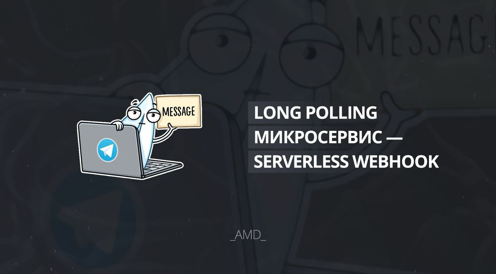
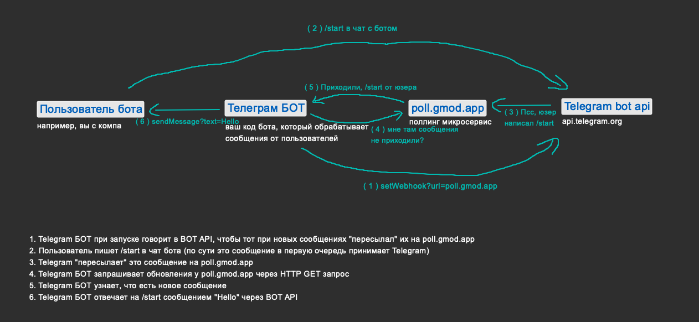
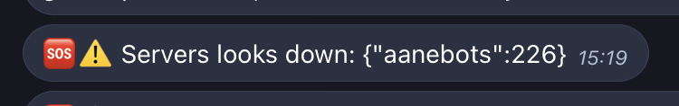
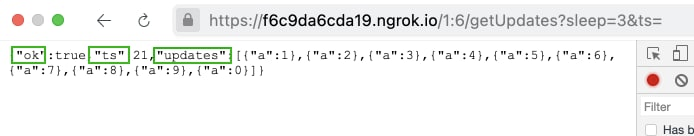

# Self-Hosted Long Polling микросервис. Зачем и как



:::note

Этот пост – актуализация и перепись [двух](../../2021-11-15-poll-gmod-app-docs.md) [старых](../../2021-03-08-webhook-bez-web-servera.md) постов на эту тему.

:::

`poll.def.pm` – это простейший **[open-source](https://github.com/TRIGONIM/lua-long-polling)** Long Polling сервер, который выступает в качестве своеобразного WebHook сервера и хранит в себе полученные updates.

> 🌈  Вы можете указать **единый вебхук** url на всех API сервисах, с которыми работаете, затем получать эти вебхуки со стольки своих сервисов, сколько создадите.
>
> - **В любое время**. Даже если ваш сервис был offline, данные не теряются
> - **Мгновенно**. Как только приходит новый апдейт, вы сразу его получаете. Без задержки
> - **Без спама GET запросами**. Соединение с long-polling не разрывается, пока не придет апдейт.
> - **Получаете везде одновременно**. Например телеграмовский `getUpdates` запрещает одновременно получать апдейты на нескольких серверах. Так ваш бот не сможет работать по частям на разных серверах.

<!--truncate-->

Рекомендую прочесть [это](https://learn.javascript.ru/long-polling), если вы представляете LongPolling как спам GET запросами (это не так).


*Одной этой схемы достаточно, чтобы понять как все работает на примере Telegram бота*

## Кому и зачем это нужно

Изначально был создан, чтобы получать мгновенные пуш сообщения (вебхуки) в Garry's Mod, где нельзя было сделать веб сервер.

Сейчас использую для получения апдейтов с телеграм ботов, а также одновременно с других сервисов. **С ним нет необходимости создавать отдельный веб сервер под каждый сервис**, что еще проблематичнее, если апдейты нужно получать на разных серверах.

### Реальные use-cases

Список реальных сценариев использования, которые мне показались полезны

<details>
<summary>👉 Открыть список</summary>

#### Модульный сервис

<!-- У меня есть забавный телеграм бот, который я писал для Garry's Mod. Он позволяет сделать "мост" между игровыми серверами и телеграмом. С телеграма можно было писать в чат серверов, а с серверов в чат телеграма и на другие сервера. Одинаковый код был запущен сразу на нескольких игровых серверах. -->

Это касается не только Telegram ботов, просто мне это ближе по духу.

1. Бот запущен на нескольких игровых серверах одновременно. В боте была команда `/players`, которая присылала список игроков. Каждый бот на каждом сервере получал эту команду и присылал список игроков. Была еще команда `/select $servername`, которая позволяла выполнять любую команду на любом сервере. **!BAN CHEATER**

2. Одна часть бота написана на python, другая на lua. На питоне реализована команда `/computervision`, на lua все остальное. Я просто вынес функционал, который нельзя было сделать на Lua в другую среду. На Lua не было хендлера такой команды, а на питоне не было хендлера остальных команд. Так что ничего не конфликтовало.

#### healthcheck



Подобно модульному боту, мой healthcheck работал так, что каждый сервер проверял друг друга. На одну поллинг ссылку все отправляли сигнал "я $имя и я живой". И каждый по такой же ссылке знал, кто живой. Если один из сервисов падал, то любой другой сообщал "тут сервис погиб, помогай". Масштабировалось все это простым включением нового сервиса.

#### Отказоустойчивость


*зачем я вставил картинку с печенью..?*

Ниже пример для телеграм, но он применим для любого сервиса.

Если бот отключился, а люди продолжают писать, то с вебхуком вы навсегда потеряете эти сообщения. С long-polling сервисом они сохранятся и после перезапуска бота пользователям придут ответы на их сообщения.

#### luadev

Я [подредачил](https://github.com/AMD-NICK/vscode-gmod-luadev/commit/046a083257e90e28bb5273010f940603becd4edf) один плагин для VSCode, чтобы выполнять Lua код прямо в runtime среде любого моего приложения. Плагин при нажатии сочетания клавиш отправляет код, который нужно выполнить на long-polling. Все игровые сервера, все телеграм боты и все веб приложения получали этот код через одну ссылку. Если нужно было выполнить код где-то конкретно, то я просто в начале писал что-то на подобии `if not BOT_REPOSTER then return end`

#### Чат

Простейший чат. На веб странице клиентский js чатик. При нажатии "отправить" выполняется POST на лонг-поллинг. Все посетители при входе на страницу делают GET + ?sleep=60 и сразу видят старые + новые сообщения.

#### Работа в среде, где нельзя поднять веб сервер

Мы в `gm-donate.net` раньше предлагали людям установить .dll модуль на их сервер, чтобы работали мгновенные пополнения баланса, потому что в GMOD нельзя поднять веб сервер (вебхук) без сторонних приколюх. Сейчас мы просто отправляем пуши на уникальный для каждого сервера long polling url, с которого в Garry's Mod очень легко получить апдейты.

</details>

## Где скачать, как запустить?

Вы можете либо использовать публичный `poll.def.pm` для небольших проектов либо в тестовых целях, либо можете запустить свой сервер и настроить его под свои нужды.

Полная инструкция есть в репозитории на GitHub: [lua-long-polling](https://github.com/TRIGONIM/lua-long-polling).

Самым простым self-hosted вариантом будет запуск через Docker:

```bash
docker run -p 3000:3000 ghcr.io/trigonim/lua-long-polling:latest
```

## API

### Безопасность

Мы хотели сделать максимально простой API, поэтому нет никаких токенов, паролей, регистраций. Все данные считаются публичными (любой может прочесть или записать), как в blockchain. В блокчейне ваша защита это ваш секретный ключ. Здесь точно так же:

- ` GET https://poll.def.pm/SECRET_UID`
- `POST https://poll.def.pm/SECRET_UID`

Только тот, кто будет знать `SECRET_UID`, сможет получить или отправить данные.

### 📥 Получение апдейтов

Вот пример ответа от сервера при переходе по `https://poll.def.pm/SECRET_UID`.


*Возвращается массив с полями ok, ts и updates*

- `updates` это таблица (список) отправленных через POST запрос данных. Для наглядности: `curl -X POST -H "Content-Type application/json" -d '{"a": 1}' "https://poll.def.pm/SECRET_UID"`. Так отправляет данные на вебхук телеграм, вк, гитхаб и вообще все.
- `ts` это "offset". На скриншоте ts = 21, это значит, что `SECRET_UID` получил 21 update. Если в параметрах GET запроса указать `?ts=19`, то сервер вернет 20й и 21й update.

#### Параметры GET запроса

- `?ts=12345`. Описан выше, рядом с описанием поля
- `&sleep=0`. default 0, max 60. Если в примере выше указать `ts=21` (т.е. текущее кол-во апдейтов), то сервер вернет результат либо сразу, когда получит 22й апдейт, либо пустой результат (`{ts = 21, updates = {}}`) через указанное количество секунд. **Это главное, что отличает Long Polling от обычного поллинга, при котором вы спамите ссылку запросами**.

### 📤 Отправка апдейтов

Как правило, в сервисе, который отправляет вебхуки достаточно указать ссылку `https://poll.def.pm/ANY_SECRET`. Сервисы отправляют вебхуки POST запросом в формате `application/json`.

**Но вы можете добавить к ссылке любой набор параметров, который будет объединен с апдейтом**. Например, при обычном `POST poll.def.pm/SECRET_UID -d {"foo": "bar"}` updates будет `{..., {foo = "bar"}}`. При `POST poll.def.pm/SECRET_UID?any=value -d {"foo": "bar"}` updates уже будет `{..., {foo = "bar", any = "value"}}`.

Это полезно, когда вы хотите на одну ссылку отправлять данные сразу с множества сервисов, либо телеграм ботов, либо чего угодно. Если отправлять данные "как есть", то вы не будете различать, что апдейт пришел от `telegram1_bot` или от `telegram2_bot`. Но если сервису устанавливать вебхук с приставкой `?appname=telegram1`, то вы легко сможете понять, кто прислал апдейт.

## Готовые клиенты

- [Базовый клиент](https://github.com/TRIGONIM/lua-long-polling/blob/main/lua/long-polling/client.lua), который написан для чистого Lua, но есть:
- [Адаптация базового клиента](https://github.com/TRIGONIM/lua-long-polling/blob/main/examples/garrysmod-client.lua), чтобы его можно было использовать в Garry's Mod

Очень легко написать клиенты на любом языке программирования. Даже chatgpt справится, просто скиньте ему lua версию и скажите переписать на ваш язык.

Если реализуете – скиньте в ЛС или issues, буду рад ❤️

## Дисклеймер

Упомянутые `poll.def.pm` и `poll.gmod.app` можете воспринимать исключительно как "демо" версии лонг поллинг сервиса. Каждый домен работает уже несколько лет, но на них есть рейт лимиты и ограниченное количество хранимых апдейтов. Для использования в ваших нагруженных проектах будет лучше захостить сервис самостоятельно, чтобы снять лимиты. **Я не несу ответственности, если вы что-то потеряете, если вдруг я отключу один из доменов.**
