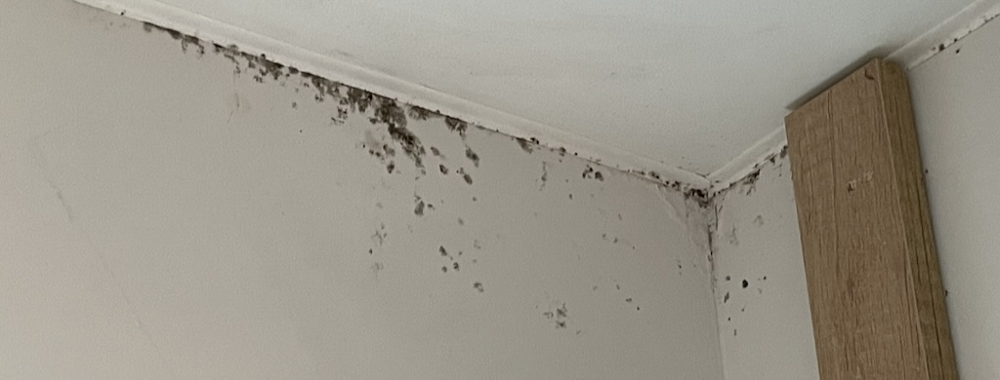
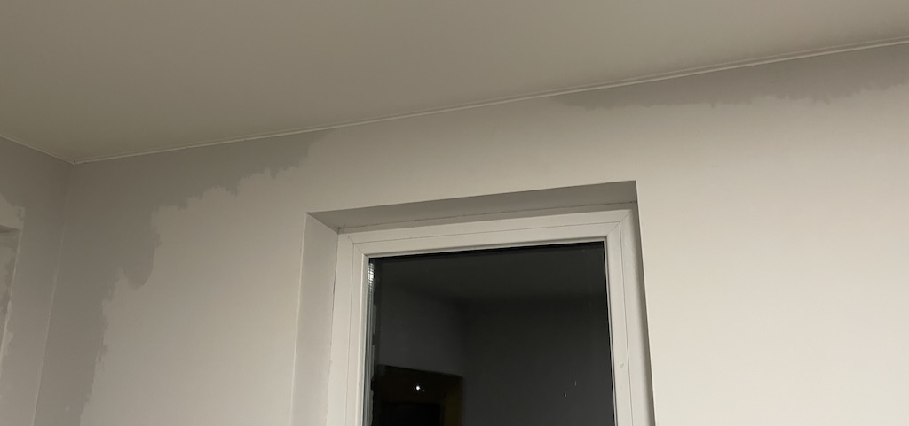
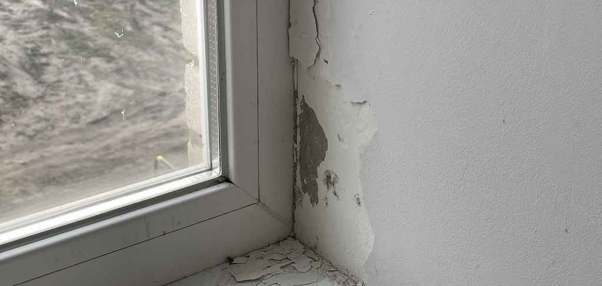
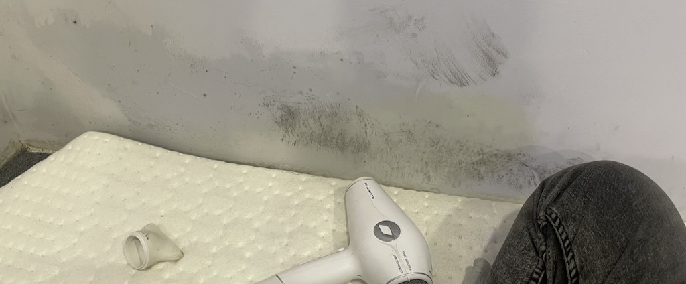
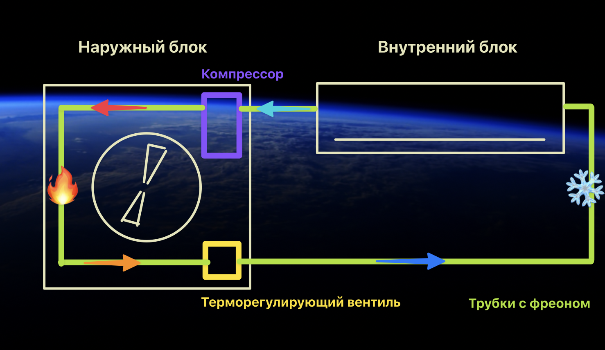
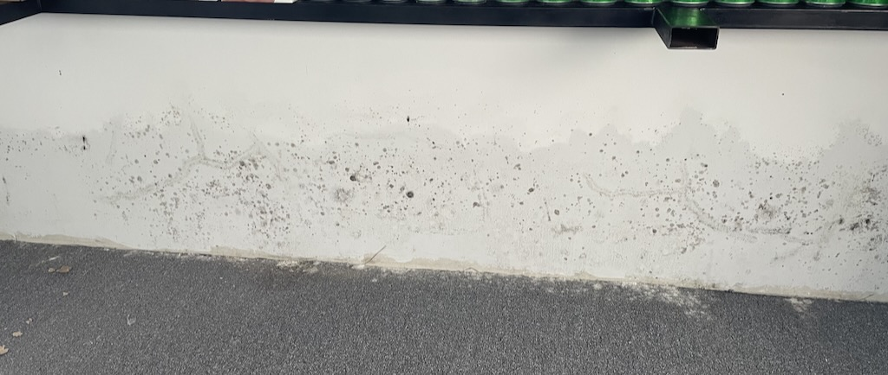
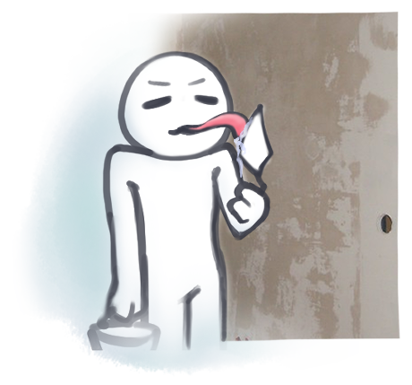
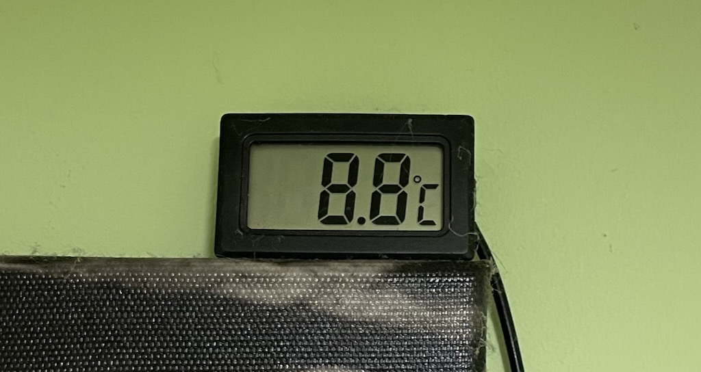
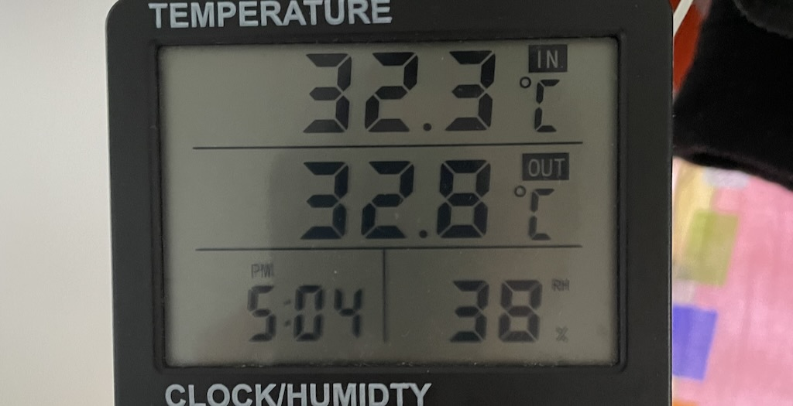
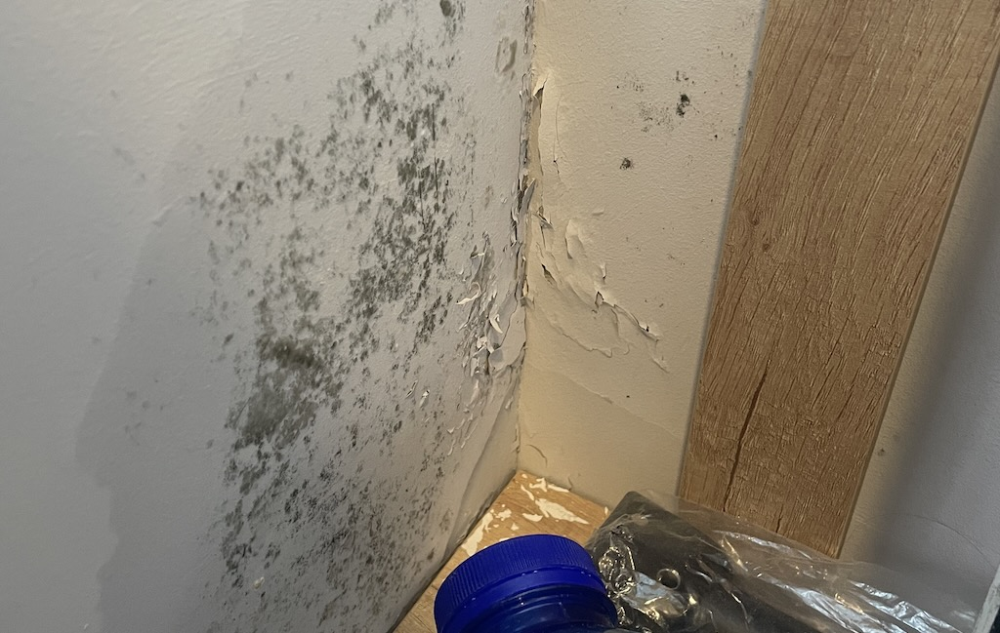

# Про мокрые углы, точку росы и плесень в доме

Хочу поделиться своим горьким опытом и бесплатным решением проблемы с плесенью в доме.

Эту зиму я решил провести на даче. Стены тонкие, дом высокий, а не широкий (у комнат нет соседних помещений), зима короткая, зато холодная. Все это привело к появлению влаги на стенах и в углах, запаху сырости и отслоению краски со шпаклевкой.

Я много раз слышал термин "точка росы" и с умным лицом **притворялся**, что я понимаю, что это. Я сам так считал.

<!--truncate-->

Правду я начал осознавать на практике, когда начал постоянно обращать внимание на мой домашний датчик влажности (гигрометр). Но перед этим расскажу, с каким адом я столкнулся.

## Мокрый ад

Моя дача только-только пережила полноценный ремонт. Новая штукатурка, краска, красота. Летом я начал ее обживать, как полноценный домик, а зимой уже тратил десятки рулонов туалетной бумаги, чтобы просто вытирать стены и окна от влаги. Тоесть, воды. Потому что ее было так много, что иногда можно было видеть полноценный ручей.

Газа нет. 24/7 работали кондиционеры на обогрев. В спальне и при входе дополнительно стоял обогреватель. **Каждый месяц уходило от 3 до 5 тыс киловат электроэнергии**. Никаких тарифов "день-ночь" нет. Теперь на секунду остановитесь и посчитайте сколько это в деньгах. Это чья-то зарплата.

Как итог – все равно тепло было только в кофте и только если не открывать двери в прихожую (там морозильник). А окнам и стенам пофиг – "мы такие влажные, поухаживай за нами". И я снова тащу рулон парашки.

> На фото выше сухо, но отслоения начались как раз из-за постоянной влаги в той зоне. Тут рядом "сушилась" одежда

Гигрометр почти всегда показывал влажность 70%, временами доходил до 80%. Если вы не понимаете, много это или мало, 60% это ПИК нормы в теплом помещении, а золотая середина – 45%. Причем в холодном помещении даже 5% разницы влажности **уже могут создавать росу на окнах**.

## Точка росы очень простыми словами

В любом месте земли и в доме в воздухе есть влага. Когда вы моетесь, потеете, готовите еду, кипятите чайник, сушите одежду, даже дышите – начинает испаряться влага. Оставьте чайник включенным на час и вода с него окажется у вас в воздухе. А в моем случае на стенах и окнах.

Квартиры и дома, как правило, это почти герметичные сосуды. **Вся влага, которая испаряется – не исчезает, а насыщает воздух**.

> На фото выше я феном сушу стену в закрытом помещении. Как можно догадаться, испаренная влага снова окажется на стенах

:::info

**Точка росы** – это температура, при которой влага уже не может просто "существовать" в воздухе и начинает оседать на холодных поверхностях – бутылка из холодильника, окна, стены, трава утром на холодной земле. Чем больше влажности – тем выше нужна температура, чтобы ее удерживать в воздухе, а не на стенах.

:::

## Про кондиционеры

Эту часть можно пропустить, если вы точно понимаете, как работают кондиционеры и почему "портативные кондицинеры" не могут существовать.

> Для меня давным-давно просмотренное видео про кондиционеры внесло свою долю в понимание того, как побороть влагу в доме.

Кондиционер состоит из двух частей – внутренний блок и наружный блок. На обеих блоках есть радиатор. **Когда вы летом включаете кондиционер**, внутри помещения радиатор становится холодным, через него вентилятор дует воздух и вам хорошо. Вся избыточная влага с воздуха собирается на этом холодном радиаторе, затем капает и через дренажную трубку выливается наружу.

**Если включить кондиционер зимой** (на обогрев), то внутри радиатор становится горячим, снаружи уже ничего не капает, а фреон "дуется" в другую сторону.

:::tip Интересные факты

- Кондиционеры не берут воздух с улицы и не вентилируют помещение
- От кондея болеют только те, кто его не чистит, потому что на нем очень сильно плодится плесень
- Когда летом внутри помещения радиатор холодный – снаружи он "закипает". Для этого снаружи стоит вентилятор для охлаждения.
- Когда кондиционер зимой вас греет – наружный блок наоборот обмерзает. Чтобы это исправить, может включаться режим Defrost, при котором кондиционер некоторое время "развернет" режим работы и внутри помещения начнет охлаждаться, чтобы наружный блок нагрелся и растопился.
- Кондиционер греется и охлаждается за счет фреона (газа), который если замкнуть в трубку и начать качать в нее давление, то с одной стороны компрессора он будет закипать, а с другой замерзать.
- Холодильник дома работает по принципу "портативного кондиционера". Там тоже фреон.

:::

Портативный кондиционер не может работать эффективно хотя бы потому что оба блока (теплый и холодный) находятся в пределах одной комнаты. Т.е. он одновременно и греет и охлаждает помещение. Единственное, что он делает – немного убирает влагу с воздуха своей холодной стороной.

## Как я начал приходить к решению проблемы

**И при чем тут гигрометр и кондиционер? 🤔**

> "Почему у моей бабушки есть комната, в которой никто не живет, не греет, но там нет ни влаги ни плесени, а комната в которой я теплее, но стены мокрые и углы в плесени?" – один знакомый.

Этот вопрос окончательно закрыл мое понимание всей сути проблемы.

**Плесень** появляется от того, что мы приносим ее на себе. Мы дышим, выделяем бактерии, поселяем их на своих влажных стенах, которые плесени очень нравятся. Еще и создаем комфортную температуру, чтобы ей было хорошо плодиться.

В природе нет такого, чтобы на поверхностях на улице появлялась плесень или была вечная влага (если нет сторонних причин). Даже зимой. В той комнате "сама природа" регулировала влажность.

**Гигрометр** показал мне, что влажность может быть одинаковой, температура разной – стены/окна по разному мокрые. Закономерность, давшая четкое понимание точки росы. До этого я не обращал внимания на влажность.

**Кондиционер** не капал на улицу зимой, а летом капал. Объяснилось почему на стенах вода. Вода любит холод.

## Как решил проблему окончательно

### Бесплатно

Сэкономил тысячи киловат, начал лучше спать и перестал использовать туалетную бумагу не по назначению. Стены стали сухими, хотя на улице все таяло и внутри было холодно.

- На даче 2 комнаты: спальня и гостиная. Раньше я почти всегда находился только в спальне, но я начал днем приходить в гостиную, а уходил спать в спальню.
- Когда я просыпаюсь, то выключаю обогреватель и открываю окна в спальне. Да, на улице мороз, но я ведь в этой комнате днем не нахожусь. Зато перед сном воздух просто космический.
- Открываю балкон на проветривание, окно на кухне, в общем, все окна, где не собираюсь находиться
- Захожу в гостиную, закрываю дверь, включаю обогреватель. Кстати, тут окно всегда в режиме форточки, даже когда обогреватель включен. Чтобы было чем дышать

Да, в коридоре холодно. На кухне холодно. В спальне холодно. Зато теперь работает только 1 обогреватель и стены уже сухие.

> Проблема была в том, что я создавал влагу 24/7 в одной закрытой комнате, откуда просто не могла никуда деться влага.

### Платно

Многие еще советуют поставить рекуператор. Что ж. Я среди них. Я уверен, что рекуператор решил бы проблему плесени и влажности в комнате. Но я слишком бедный и ленивый, чтобы покупать по рекуператору в каждую комнату, а потом еще искать тех, кто их установит. Но вы можете попробовать и я гарантирую, что это сработает.

А знаете что еще сработает? **Утепление дома**. Этим летом я хотел бы утеплить дом пенопластом и я уверен, что это тоже значительно сократит расходы на электричество и можно будет не так долго держать окна открытыми.

Когда зима начала подходить к концу, мы притащили в дом буржуйку. Она все это время стояла под окном, но было лень просто взять и занести ее в дом. К тому же казалось, что "не, ну она же маленькая, че она может то против такого мороза?". Может. Сейчас на улице 1-2 градуса, а в доме на обеих этажах почти 30 и пара окон открыто. [Plamen Tara](https://www.plamen.hr/en/Proizvod/63). Те, у кого дома есть хорошая буржуйка, наверное и так знают, что это "читы", но свою проблему я решал до ее появления.

## Заключение

Надеюсь, что мои облезшие стены, скопившаяся плесень, куча потраченных сил и денег, сохранят деньги вам или хотя бы вы во время какого-нибудь застолья встанете и начнете рассказывать кому-то с умным лицом про точку росы и про работу кондиционера, как это не один раз уже сделал я 🙂

А если остались какие-то вопросы – задавайте в комментариях или пишите мне в телеграм (контакты есть на сайте). Я бы хотел дополнять этот пост, так как тема мне интересна.

А я тем временем буду ждать лета, латать стены, а потом новой зимы, чтобы проверить еще кое-какие лайфхаки на практике, прежде чем советовать их остальным.

*И маленький бонус:*

> Плесень в прихожей. С двух сторон тоненькие стенки. Я даже не знаю, как все это летом буду исправлять

