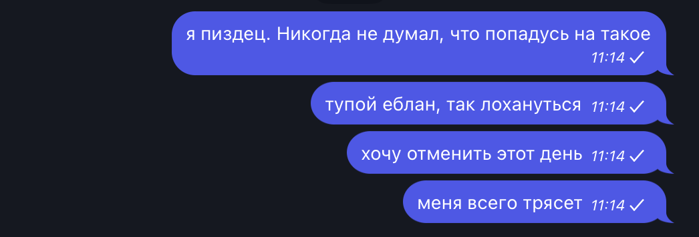
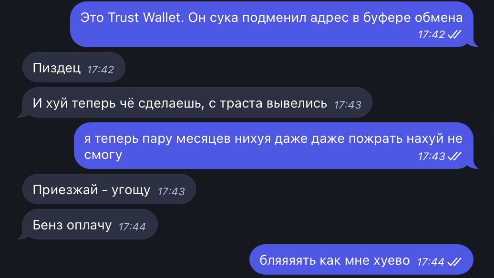
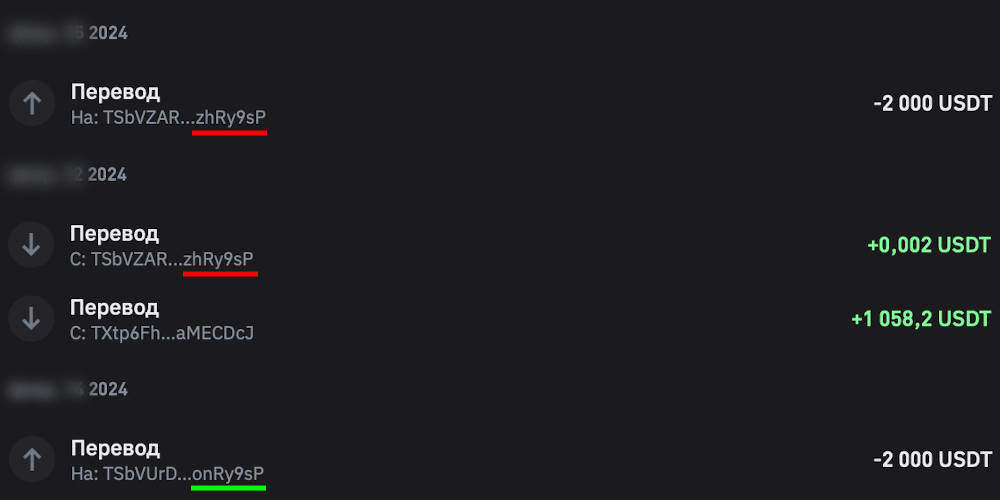

# Как меня развели на $2,000

**Заскамили, как мамонта. Никогда не мог подумать, что попадусь на такое.**

> Кратко о том, как несколько дней назад лил кровавые слезы и что случилось.

Часть оборотных денег я хранил на криптовалютном кошельке в USDT (криптоаналог доллара). Так мои сбережения были в большей степени защищены от инфляции национальной валюты и всем известных банковских "бзиков", когда счет могут заблокировать "за подозрение в подозрении".

<!--truncate-->

Однажды вечером, когда мне потребовалось отправить деньги с кошелька на биржу, я проделал почти класическую для этой процедуры операцию – зашел в Trust Wallet, скопировал адрес кошелька для пополнения биржевого счета из последнего пополнения, ввел сумму и нажал "отправить".

Вы еще могли не заметить, но **я скопировал адрес из пополнения**. Не списания, как отправляю деньги на биржу, а из зелененькой такой транзакции на 0.002$.

> Только лох на такое поведется. И я попался.

"Мой адрес из буфера обмена подменили! Это мог сделать только сам Trust Wallet" - подумал я.

Но нет. Все оказалось куда проще.

После пополнения баланса, вследом за этим мне прислали 2 микроцента **с адреса, который очень сильно похож на нужный мне адрес**. При переводе на "биржу", я скопировал адрес скамера и просто отправил на него деньги.

> Эта атака называется [Address Poisoning](https://community.trustwallet.com/t/the-rising-threat-unmasking-the-mechanics-behind-crypto-address-poisoning/822098)

**Когда речь идет о криптовалюте, безопасность твоих денег зависит только от тебя**. Скачал вирусняк, где-то запалил секретный ключ, взломали менеджер паролей – только твоя вина. Некому жаловаться. Никто, кроме тебя не может быть виновен в потере денег (разве что USDT обесценится).

Жаловаться было некому. Лишь осознать, что тебе предстоит пройти 5 стадий принятия неизбежного и сделать усилие над своей ментальностью, чтобы сделать это быстрее.

Как говорится: "хорошо, что судьба взяла деньгами". В конце концов, все же я жив и здоров и может даже кто-то на моем опыте ~~запустит свою скам схему~~ не потеряет деньги
