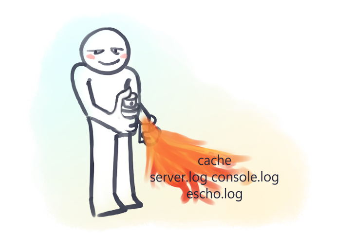
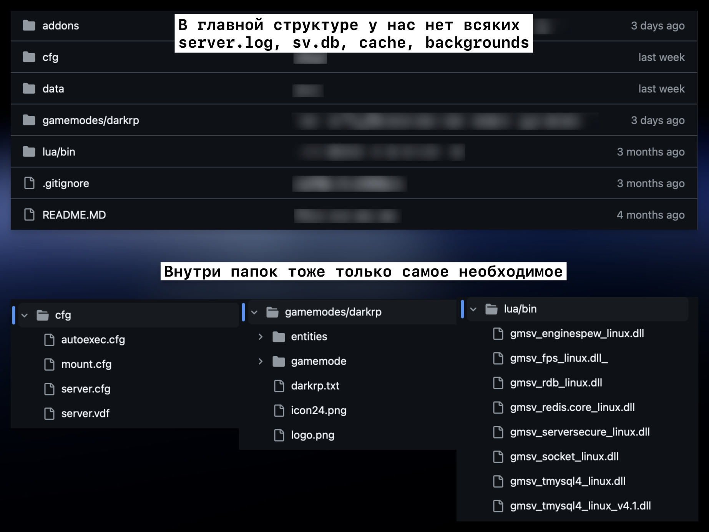
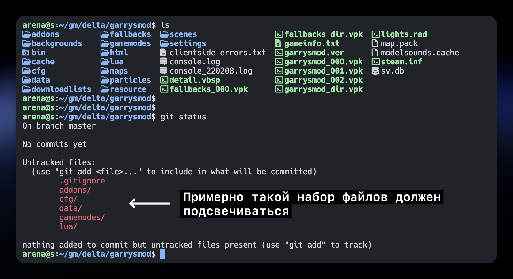

# Дружим Garry's Mod сервер и Git правильно

Я годами не мог придумать, как сделать, чтобы на Git хранились только самые необходимые файлы и папки без мусорных (cache, backgrounds, console.log и т.д.). Казалось бы, простая задача, но решил я ее лишь недавно.



> Это все нужно было для того, чтобы удобно работать с сервером через плагин [VSCode Remote SSH](../../2023/07-24-vscode-remote-ssh/index.md), словно сервер находится на локалке и при этом любые изменения с легкостью пушить на GitHub **без лишнего мусора**

<details>
<summary>А зачем в гмоде вообще Git?</summary>

- Возможность редактировать код с любого устройства, где есть браузер, даже с телефона друга
- GitHub хранит историю изменений файлов сервера
- Видно кто и когда и что изменял. Почти невозможно незаметно подложить бекдор.
- Может служить своеобразным бекап-хранилищем вашего проекта
- Поиск по файлам сервера прямо в браузере.
- Возможность [поделиться ссылкой](https://github.com/GM-DONATE/IGS/blob/67ad529de53d0ace71b539e74276e97c534f32e3/addons/igs-core/lua/igs/apinator.lua#L27-L35) на код

</details>

<!-- truncate -->

## Финальный результат



> **Чтобы репозиторий был без сотен или тысяч других файликов, к которым мы никогда не полезем**.

- чтобы корень git репозитория был `/garrysmod`
- сохранить из `/cfg` лишь несколько файлов из десятка
- из `/gamemodes` только 1 папку вместо 3-4
- из `/data` только то, что +- статично (не логи, а конфиги и т.д.)
- из `/lua` только `/lua/bin` (если он есть)

## Зачем, а главное нахYя


Во-первых, потому что так надо. Во-вторых, потому что я так захотел. Что еще нужно то 🤗?

Вообще, я решал проблему удаленной разработки. Раньше я использовал плагин SFTP для VSCode. Он работает по примитивному принципу: сохранил файл, он запушил его по SFTP на сервер. У плагина были недостатки:

- **Он требовал чтобы локально у тебя была точная копия файлов сервера**.
	Проблема, когда у тебя пара мест, в которых ты регулярно бываешь.

- **Если кто-то менял файл на сервере, то твоя локальная копия уже отличалась от файлов на сервере**.
	Проблема, когда работаешь с кем-то или нужно срочно пофиксить баг прямо на сервере.

- **Если кто-то поменял файл прямо на git, то он сам не попадет на сервер, пока его вручную туда не обновить**.
	Проблема, когда у тебя не 1 файлик, а 10+. Нужно сначала делать `git pull` на локалке, затем каждый измененный файлик пересохранять, чтобы он попал на сервер.

Без SFTP плагина я могу изменять код хоть на сервере, хоть дома на компе, хоть на самом гитхаб, хоть играться с git ветками и синхронизация всего этого будет на кончике пальцев: `git pull`. Можно даже ~~прихуярить монитор~~ приделать workflow автоматического деплоя на продакшен при пуше в `master`, но это отдельная история.

## Последовательность действий

1. Создать пустой приватный GitHub репозиторий.
2. Настроить ключи доступа, чтобы выполнять git-команды без пароля.
3. Залить сборку гмод сервера прямо с VDS в новоиспеченный пустой репозиторий.
   Уже без лишних файлов.

Для начала регистрируйтесь на GitHub, создавайте приватный репозиторий, **на сервере настройте SSH ключ для доступа к приватным репозиториям**: [инструкция](../../2021-11-02-git-ssh-setup.md). Когда сможете без логина/пароля сделать `git pull git@github.com:ВАШ-ЛОГИН/ВАШ-РЕПОЗИТОРИЙ.git`, тогда и продолжаем.

Приступаем к загрузке в наш пустой репозиторий основных файлов нашего сервера:

```bash
# В корне папки сервера (в папке /garrymod)
git init
git remote add origin git@github.com:ВАШ-ЛОГИН/ВАШ-РЕПОЗИТОРИЙ.git
git fetch

# PRO Tip: Если вводить через терминал VSCode,
#   то файл откроется именно в VSCode
#   и не придется мучиться со всякими nano/vim/micro
code .gitignore
```

> `.gitignore` сейчас пустой, мы его только создаем. Этот файл отвечает за то, какие файлы попадут или НЕ попадут на Git.

Ниже скриншота мое содержимое `.gitignore`. Отредактируйте под свои нужды, пока команда `git status` не перестанет показывать ненужные файлы. Финально должно получиться примерно так:



<details>
<summary>Содержимое моего .gitignore</summary>

```shell
# Игнорируем целые ненужные папки
/backgrounds
/bin
/cache
/download
/downloads
/downloadlists
/fallbacks
/html
/maps
/particles
/resource
/scenes
/settings

# Игнорируем в корневой папке все ФАЙЛЫ (не папки), кроме парочки (sv.db, console.log, etc)
/*.*
!/.gitignore
!/*.code-workspace
# !/sv.db
# !/console.log

# /cfg файлы, кроме выбранных
/cfg/*
!/cfg/autoexec.cfg
!/cfg/mount.cfg
!/cfg/server.cfg
!/cfg/server.vdf

# Игнорируем в /data все, кроме некоторых конфижных и редкоизменяемых файлов
# 	Это убило часа 3 моей жизни, потому что я не мог додуматься поставить .* в конце, а ставил просто /*
# 	Для .gitignore когда пишешь /* он думает про непонятно что, а /*.* имеется в виду "что-то.расширение"
# 	Боже, надеюсь я не забуду этой логики. https://www.atlassian.com/ru/git/tutorials/saving-changes/gitignore
# 	Короче НЕЛЬЗЯ игнорить папку, иначе тогда "!" в начале не работает. Приходится форсить игнор файлов в папке
# 	/** в конце значит, что игнорим дальше даже папки и файлы в подходящих папках. Короче жрем даже слеши
# 	/* игнорим только файлы до слеша. Поэтому в /perments **
/data/**/*.*
!/data/ghomes_system/**
/data/ghomes_system/mails
!/data/trigon_scripts/perments/**
!/data/ulib/groups.txt
!/data/ulx/adverts.txt
!/data/ulx/banreasons.txt
!/data/ulx/gimps.txt
!/data/vcmod/fuelstations/*
!/data/vcmod/repairman/maps/*

# Из /lua папки убираем все, кроме /lua/bin
/lua/*
!/lua/bin

# Из /gamemodes убираем base, sandbox, terrortown (остается darkrp и если что-то будет еще создано, то оно тоже)
/gamemodes/*
!/gamemodes/darkrp
# /gamemodes/base
# /gamemodes/sandbox
# /gamemodes/terrortown

# Игнорируем тяжелые файлы
# # models & materials
# *.xcf
# *.mdl
# *.phy
# *.vtx
# *.vvd
# *.vmt
# *.vtf
# *.pcf

# # sounds
# *.wav
# *.mp3
# *.ogg

# # web shit
# *.eot
# *.svg
# *.ttf
# *.woff
# *.otf

# macos shit
*.DS_Store
```

</details>

Если лишние файлы не подсвечиваются, то загружаем все на GitHub:

```bash
git add --all
git push
# проверьте, появились ли ваши файлы на GitHub
```


В будущем при переезде на новый хост, в папке `garrysmod` уже будете вводить вот так:

```bash
git init
git remote add origin git@github.com:ВАШ-ЛОГИН/ВАШ-РЕПОЗИТОРИЙ.git
git fetch
git checkout -ft origin/master
# -f делает переключение на файлы даже несмотря на конфликты (оверрайдит локальные файлы)
# -t сразу помечает remote бренч апстримным. Без этого при пуше надо выбирать куда пушить
```

---

:::tip
Если что не так или информация в посте устарела – **свистните в комментах**. Я очень быстро его замечу (придет оповещение) и отвечу вам, что исправил пост, помогу с проблемой ~~или забью хер~~.
:::

В конце концов, натолкайте мне в комменты ху@в о том, какой я дурак и все делаю не так и что пост примитивный. Или хотя бы мем какой-то скиньте, чтобы я знал что кто-то потратил свое время на это чтиво. В конце концов, свой конфиг прикрепите с минимальным описанием почему он именно такой, а не другой.
