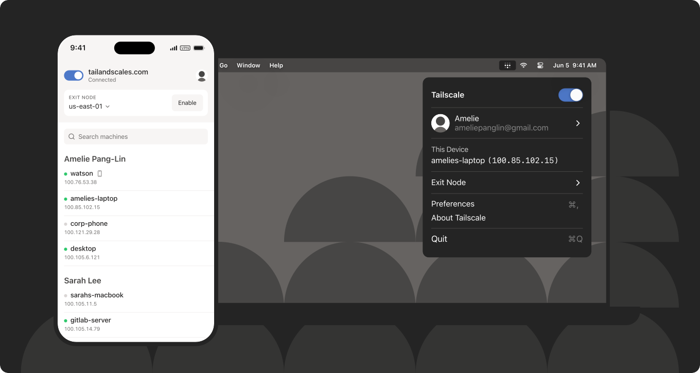
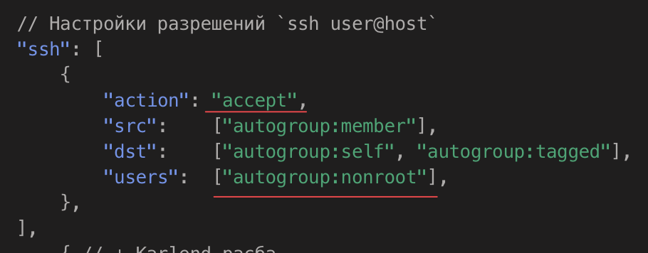

# SSH без пароля и возни с приватным ключом

🤢 Традиционно SSH это ввод где-либо пароля, либо [возня с SSH ключом](../../2021-10-05-ssh-keys.md), который нужно переносить между устройствами. Первое ненадежно, второе неудобно.

👍 Но можно сделать, чтобы в FTP и SSH клиентах нужно было указывать лишь hostname и имя пользователя. Даже на телефоне. И это без каких-либо настроек. **Больше вы не зависите от SSH/FTP клиента, "потому что в нем мои пароли сохранены".**

<!-- truncate -->

## Про [Tailscale](https://tailscale.com) на пальцах

Это приложение, которое вы легко устанавливаете на сервер, свой комп, телеф, да хоть TV и имеете связь между всеми этими устройствами, **словно они в локальной сети**.

| В качестве "бонуса" он умеет оборачивать SSH, самостоятельно управляя его безопасностью и приватными ключиками. Пока у вас на компе/телефоне будет запущен Tailscale, то вы сможете подключаться по SSH к серверу, словно на нем нет ни пароля, ни ключа, при этом сам сервер будет оставаться защищенным. |  |
|-|-|

## Хочу, как сделать?

[Установите на сервере](https://tailscale.com/download/linux) и на своем компьютере Tailscale. Обязательной настройки нет, а опциональная через панельку на сайте. Установил и забыл.

> На сервере запустите Tailscale с параметром `--ssh`, вот так: `tailscale up --ssh`.

Все 🎉

Теперь даже через cmd.exe или iSH на iPhone можно ввести лишь `ssh user@hostname` и вы окажетесь сразу в шелле сервера.

## Не-назойливая авторизация

В "[Access controls](https://login.tailscale.com/admin/acls/file)" на сайте можете прописать ssh action accept вместо check для nonroot юзеров, чтобы не приходилось каждый раз в консоли по ссылке для авторизации переходить.

## Бонус

Отключение дополнительной проверки авторизации на SSH с переходом по ссылке, привычный всем VPN, который "меняет IP" и прочие "советы и фишки" Tailscale вы можете найти вот здесь: 🔥 [клик](/docs/other/vpn/tailscale)
