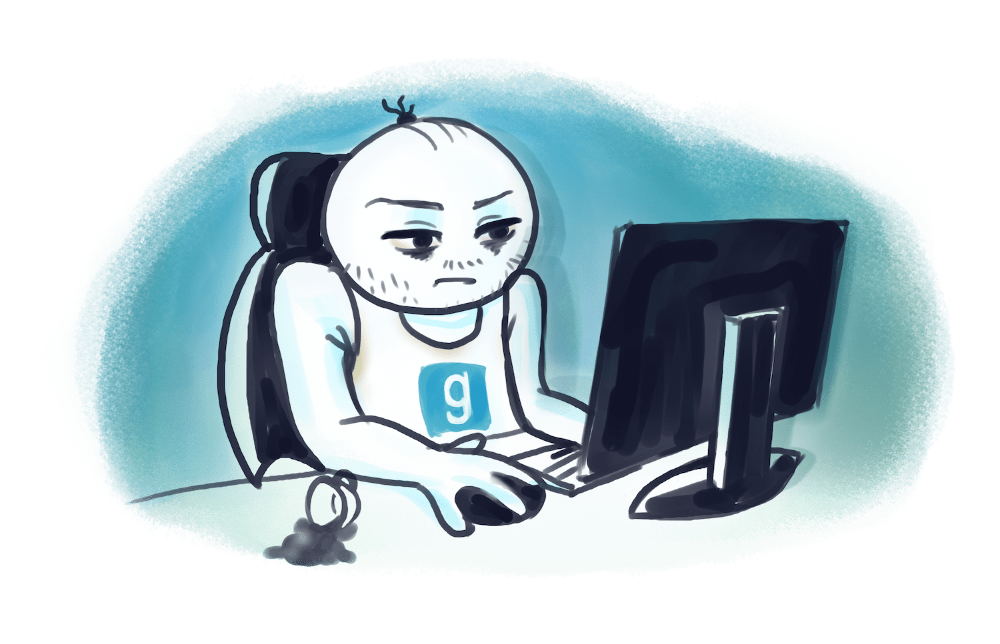
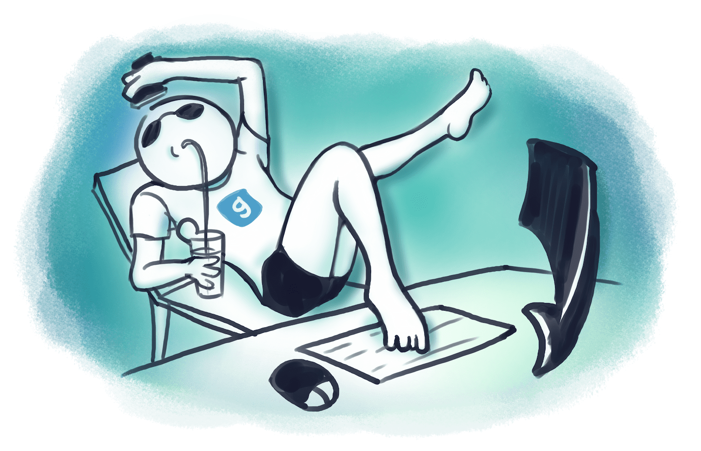
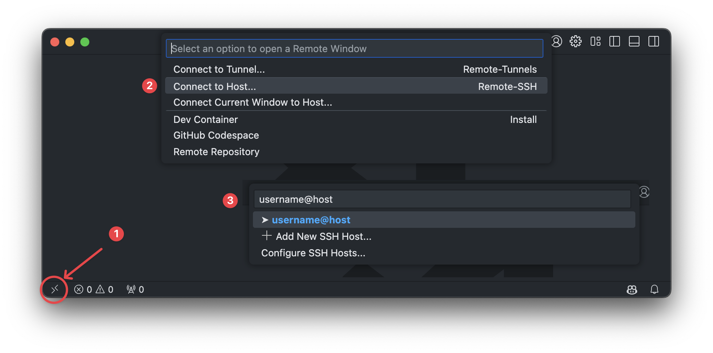

# Разработка в Garry's Mod без локального сервера, FileZilla и Putty

:::info
Я уже [писал пост](../../2020-03-17-gmod-development.md) на эту тему в 2020 году, но с того момента все изменилось и радикально **упростилось**. И все равно я советую прочесть пост 20го года.
:::

## Разработка курильщика

<!-- /\ Не воровать! Сестренка рисовала ❤️ -->

**Если вы все еще:**

- 🤢 Пишете код "на локалке"..
- 🤢 ..через Notepad++ или SublimeText.
- 🤢 Используете FTP клиент (FileZilla, CyberDuck, не важно)
- 🤢 Подключаетесь к серверу через Putty / игровую консоль в браузере
- 🤢 Делаете бекапы вручную или скриптиками
- 🤢 Используете хостинг с FTP и консолькой вместо своего сервера с SSH
- 🤢 Авторизируетесь в SSH по паролю или таскаетесь с приватным ключом

Тогда мы идем к вам!

<!-- truncate -->

Узнаете себя? Постоянный Ctrl + S и переключение между редактором, файлзиллой и гмодом, переносы файликов, бардак в версиях на локалке и проде и т.д.. мраак

## Разработка здорового человека

Если бы Баунти с его райским наслаждением кодили в гмоде, то это выглядело бы вот так:

- 👍 Все файлы всегда только на удаленном сервере. На локалке их нет.
- 👍 При этом поиск по файлам и работа с ними ведется, словно мы кодим на локалке.
- 👍 Ctrl + S сохраняет и применяет файл в игру. Без подтверждений и лишних переключений.
- 👍 Код писать можно хоть с телефона. И даже чужого. Легкий, но надежный доступ к файлам и консоли.
- 👍 Разработка с любой точки мира 24/7.
- 👍 Свежий код сервера всегда доступен в интернете на GitHub (уже страшно от слова git?). По сути, ваш бекап.
- 👍 Доступ к SSH VDS'ки (снова страшно?) без ввода пароля и/или пути к секретному ключу 😱
- 👍 Можно прикрутить всякие [автоматизации](../../2022/09-10-gmod-minify.md).
- 👍 **Все в рамках одного приложения** 🎉

## Нам понадобится

1. 🪠 Приложение VSCode с 2 плагинами
2. 🚽 VDS / Dedicated server, научиться базовой работе в терминале

:::info[Заметка для жертв игровых хостингов]
Если вы сюда попали, то наверное всю жизнь пользовались услугами хостингов и тогда **сейчас вам будет страшно**, потому что придется столкнуться с vds, ssh, git и linux 👻.

**Сейчас задача не обосраться ❗**, а сделать небольшое усилие, которое окупится в 1000 раз на долгой дистанции и 100% пригодится по жизни за пределами Garry's Mod. Но это, конечно вам решать.

**Я прошел все это и был на вашем месте и сейчас понимаю, что оно того стоит. Мне за эти слова не платят, так что Think about it.**
:::

### 1️⃣ VSCode

> Я тоже не с первого раза смог привыкнуть к VSCode. Он был мне очень неудобным и я его хейтил. Не будьте, как я. Перепривыкайте. Поверьте, это в тысячу раз лучше Notepad++ и в 100 раз лучше SublimeText.

После установки самого VSCode, установите 2 плагина (Ctrl + Shift + X):

- Remote SSH и прочтите [это](../../2023/07-24-vscode-remote-ssh/index.md).
- Lua Language Server ([клик](https://wiki.facepunch.com/gmod/LuaLanguageServer)) + [подплагин](https://github.com/luttje/glua-api-snippets) для подсказок по Garry's Mod функциям

> Больше интересного про настройку и использование VSCode я писал [тут](/docs/macos/apps/vscode)

### 2️⃣ Linux сервер

Придется столкнуться с Linux, терминалом и [экономией денег!!](https://forum.gm-donate.net/t/vds-vs-igrovoj-server-na-myarena/2100). У страха глаза велики, а вы просто арендуйте где-то сервер и попробуйте.

- Рекомендую ОС Ubuntu.
- А [вот тут](https://forum.gm-donate.net/t/posovetujte-hosting-dlya-garrys-mod-servera/832) советы по выбору хостера.
- А [вот тут](https://forum.gm-donate.net/t/optimizacziya-servera-silno-lagaet/2029/2) по выбору процессора.
- А [вот тут](https://wiki.facepunch.com/gmod/Linux_Dedicated_Server_Hosting) инструкция как установить Gmod сервер на VDS и CSS контент на сервере (да, на сервере тоже нужен CSS контент)
- Чтобы сервер не выключался при закрытии терминала, прочтите это: [клик](https://forum.gm-donate.net/t/vds-vyklyuchaetsya-server-posle-zakrytiya-terminala/3396)

:::info
Когда хостер выдаст вам логин/пароль от SSH и вы будете вводить пароль, то он не будет отображаться. Просто вводите и потом жмите Enter
:::

## Шо дальше?

1. Подключитесь к серверу через VSCode Remote SSH. Вы должны увидеть через него список своих файлов и получить доступ к терминалу SSH прямо из VSCode. Терминал открывается по `Ctrl + ё`, но мне удобнее через `Ctrl + J`

2. Как хотите запустите свою сборку на VDS, но консольные команды и управлять файлами учитесь через терминал VSCode. Хотя самый первый раз файлы на сервер удобнее всего будет залить через FTP клиент. Просто в дальнейшем забудьте о нем навсегда.

Всё. Теперь редактируйте код через VSCode прямо на удаленном сервере, словно сервер находится на вашем ПК. Консоль сервера тоже прямо в VSCode.

## Дальнейшие апгрейды

1. Установите на сервер Tailscale [как сказано тут](../01-27-easy-ssh-with-tailscale/index.md). Это даст возможность входить по SSH без пароля.

2. Хотите код сервера прямо в браузере с историей каждого изменения? Тогда прочите это: [клик](../../2024/12-30-gmod-git-setup/index.md)

3. Поищите [тут всякие полезности](https://forum.gm-donate.net/t/awesome-garrys-mod-delimsya-poleznymi-shtukami/8271) и примените их в деле

---

:::tip[Остались вопросы?]
Welcome To [Гмодерский Telegram чатик](https://t.me/+pf3ZgCscKR85ZmIy) 👈

При входе скажи, что ты отсюда и получи ~~300 бесплатных спинов~~ лайк от меня
:::

