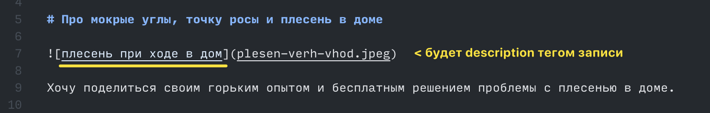

# Docusaurus

Генератор статичных сайтов. Подходит для блогов, документаций, даже лендинг страниц. Не требует своего хостинга, легко редактируется с любого устройства. Работает на Vercel, markdown хранится на GitHub

## Plugin/Component Development Notes

Пытался сделать (может и сделал) плагин для отображения обратных ссылок на посты (backlinks). [Нашел](https://github.com/facebook/docusaurus/discussions/8217) (issue) [готовое](https://github.com/anaclumos/extracranial/blob/9f7b72bd58441dd614d9fb0dd6e9625c6875ed47/src/components/Backlink/index.tsx#L62) (компонент) [решение](https://github.com/anaclumos/extracranial/blob/9f7b72bd58441dd614d9fb0dd6e9625c6875ed47/src/theme/DocItem/Layout/index.tsx#L56C11-L56C45) (добавление на doc страницы), но в нем используется внешний предварительных [парсер ссылок](https://github.com/anaclumos/extracranial/blob/9f7b72bd58441dd614d9fb0dd6e9625c6875ed47/tools/process-backlinks.py) (process-backlinks.py). Т.е. перед коммитом нужно выполнять сторонний скрипт, который создает [`backlinks.ts`](https://github.com/anaclumos/extracranial/blob/9f7b72bd58441dd614d9fb0dd6e9625c6875ed47/src/data/backlinks.ts). Я хотел переделать для использования API.

[Вот тут](https://github.com/Arsero/docusaurus-graph/blob/7dbcabda1236db081173c09f3c9d4cfe8b705857/src/index.ts#L37-L43) еще один чел делал граф, как в обсидиане, что подразумевает тоже сбор ссылок между ресурсами, то он парсил (зачем-то дважды) все markdown файлы в /docs, извлекал с них ссылки и потом строил из созданного .json файлика граф через `injectHtmlTags`

:::note
**🎉 Сделал!** Ушло 2 дня, миллион нервов и всего пара строк кода.. Настолько изучил Docusaurus, что наверное знаю его теперь лучше, чем некоторые его разработчики.

**🥺 Но пришлось костылить.** Нет возможности для плагина установить порядок его загрузки, а чтобы не загружать контент постов дважды, нужно дождаться загрузки плагина блога/доков, поэтому пришлось сместиться на несколько хуков выше до `postBuild`, из-за чего обратные ссылки генерируются только после билда блога, но отсутствуют при `yarn run dev`.

В ядре Docusaurus параллельно с `postBuild` всех плагинов выполняется функция проверки сломанных ссылок. Да, это реализовано не в виде плагина, но хуже того – для этой проверки заранее подготовлены и передаются данные, которые можно было передать и в `postBuild`, но разработчики рашили "вовремя" удалить их из контекста, поэтому пришлось парсить ссылки заново, пробегаясь по контентам регуляркой... Почему регуляркой? Чтобы не лексить файлы с нуля, это уже вообще убого будет. Если пара ссылок пострадает из-за кривого парсинга, то это не критично, но вроде все хорошо.

Хаха, для блог плагина есть поле .content, а для docs уже нет 🤦‍♂️. Но я так замучился, что просто уже считаю файлы с диска.

---

Короче в постБилде получаем список постов, парсим регуляркой маркдаун ссылки, сохраняем в файл `backlinks.json` (todo переделать генерацией на .ts). В компоненте делаем фетч этого файла и делаем с данных блок обратных ссылок.
:::

- На самом деле неожиданно для меня (я впервые в таком веб деве) есть "бекенд", есть "фронтенд". Фронт это когда логи летят в консоль браузера, бэк когда в консоль vscode.
- На бэке выполняются плагины. В моем случае `src/plugins/backlinks-plugin.js`.
- Плагины нужны по сути только ради [нескольких хуков](https://docusaurus.io/docs/api/plugin-methods/lifecycle-apis#postBuild): `loadContent` грузит данные для `contentLoaded` (тут content будет undefined, если loadContent не юзался), `injectHtmlTags` (и еще парочки). В них ты заранее готовишь контент и собираешь всякие данные (для например `actions.setGlobalData({"some": "shit"});`) в отличии от компонентов, в которых ты используешь то, что заранее подготовил (`import { usePluginData } from '@docusaurus/useGlobalData'; usePluginData('docusaurus-plugin-backlinks').some`).
- В компонентах используется то, что заранее заготовлено плагинами. Компоненты клиентские, плагины серверные. Компонентами можно [оверрайдить или инжектиться](https://docusaurus.io/docs/swizzling) в блоки на страницах, добавляя например комментарии или возможность эмбединга spotify.
- Встроенный дебаггер NodeJS в VSCode сильно помогал разобраться, что и как работает под капотом у Docusaurus (полный пиздец для меня, который не разбирается в этих ваших вебовских js, ts, react, css, html)
- Я начал с брейкпоинтов в [`postBuild`](https://github.com/facebook/docusaurus/blob/d025403f73cf3bb5fd6130f50111c3a5e0aa7812/packages/docusaurus-plugin-sitemap/src/index.ts) от `docusaurus-plugin-sitemap` и не понимал почему они не срабатывают. А при `yarn run dev` хук не вызывается. Будь он проклят.
- `Cmd + ,` на github открывает vscode в браузере прямо в репе. Там удобнее искать по файлам docusaurus.
- [localhost:3000/debug](http://localhost:3000/__docusaurus/debug/content) – "секретная" ссылка, которая помогает смотреть метаданные и контекст некоторых сущностей при разработке
- Вот тут в docusaurus 2 интересных места: [проверка сломанных ссылок](https://github.com/facebook/docusaurus/blob/d025403f73cf3bb5fd6130f50111c3a5e0aa7812/packages/docusaurus/src/commands/build/buildLocale.ts#L105-L112) (там можно подсмотреть как вообще с роутами все устроено и как оно понимает, что ссылка есть или нет) и рядом выполнение плагинов
- Вот тут я и сам немного запутался, но я так и не запомнил структуру контекста в разных местах. #todo написать шпаргалку для контекста плагина, компонентов и т.д.
- У [плагина блога](https://docusaurus.io/docs/api/plugins/@docusaurus/plugin-content-blog) есть теоретически полезная функция для сбора ссылок с поста: `processBlogPosts`

### Получение данных плагинов в компонентах

Данные записываются в хуке `contentLoaded({content, actions})` через НАПРИМЕР `actions.setGlobalData({"some": "shit"})`. Есть и другие варианты, например запись в json (предпочтительно для больших данных).

Получить данные в компонентах есть [3 основные функции](https://github.com/facebook/docusaurus/blob/8bc3e8a092025e424d9233b7176b4c036f02e94e/packages/docusaurus/src/client/exports/useGlobalData.ts):

```js
import { usePluginData, useAllPluginInstancesData } from '@docusaurus/useGlobalData';
import useGlobalData from "@docusaurus/useGlobalData"
```

- В `useGlobalData()` там примерно `data['docusaurus-plugin-backlinks'] = {default: {some: 'shit'}}` и так для каждого плагина. Яндекс метрика, беклинкс, контент-докс. Поле default есть у каждого плагина. Под ним и хранятся данные.

- `useAllPluginInstancesData('docusaurus-plugin-backlinks')` возвращает `{default: {some: 'shit'}}`. Не знаю зачем делать было отдельную функцию. По сути это `useGlobalData()['docusaurus-plugin-backlinks']`

- `usePluginData('docusaurus-plugin-backlinks')` > сразу `{some: 'shit'}`

### Шпаргалка по контекстам и т.п.

 – `useBlogPost()` в `src/theme/BlogPostItem.js` при оверрайде компонента блог поста

 – причина, почему так сложно с относительными ссылками: в `node_modules/@docusaurus/core/lib/commands/build/buildLocale.js` просто убрали связанные ссылки перед вызовом хуков `postBuild` плагинов

 – `processBlogPosts({blogPosts})` в `docusaurus.config.js`. [Выполняется](https://github.com/facebook/docusaurus/blob/78f44d0ae70fb98a63681b469977e8f074d339da/packages/docusaurus-plugin-content-blog/src/index.ts#L247-L256) в `loadContent` хуке плагина блога.

 – `postBuild(props)` самодельного плагина. Много интересного (роуты, исходники постов в .md, полностью загруженные данные всех плагинов, siteDir, siteConfig и т.д.)

## Полезно знать

- Контент при клике на категорию определяется в файле с `{folder_name}/{folder_name}.md`
- Если файл начинается с header 1, то он определяет название страницы
- При переходе на typesense билд увеличился где-то на 10-20 сек. Думаю, фиксится удалением algolia из пакетов
- Algolia подтверждала заявку на подключение к ним где-то месяц
- Для замены стандартной index страницы вроде в static удалил папку pages
- Стиль этого сайта писал не я, а взял с другого. Искал стили через гитхаб поиск вот так: `path:/src/css/custom.css --ifm-font-family-base`

 – не делайте картинку с дескрипшином первой строкой после h1 заголовка. Оно возьмет описание картинки как описание поста, испортив его SEO.

### Перенос с Ghost

Причины перехода с Ghost: [клик](/ghost-vs-docusaurus)

- Чтобы ссылки с Ghost продолжили работать, нужно было blog поместить на /. Делается через routeBasePath = "/" для presets.blog в конфиге. Без этого ссылки были в site.com/blog/slug
- В каждом посте сверху файла есть front-matter блок, где в каждом указан slug со старого блога
- Посты с Ghost экспортировал в Markdown через [эту тулзу](https://github.com/eloyesp/Jekyll_ghost_importer)
- Посты были экспортированы с неправильной датой. Пришлось добавлять +3 часа через самописный мини-скрипт (или вручную)
- Во многих постах были огрызки HTML. Их пришлось вручную заменять на markdown (Ctrl + F > `<figure`, `<!--kg-card-begin`, `<!--kg-card-end`)
- Вручную нужно было искать и заменять `__GHOST_URL__` на правильные ссылки
- Docusaurus впервые в репе деплоился через vercel, но он установил устаревшую версию

---

# Markdown заметки

## Выделение строк кода

```md {3-5}
### This

## Is

# Markdown

---

fux
```

## Admonitions

:::note
Some **content** with _markdown_ `syntax`. Check [this `api`](#).
:::

:::tip
Some **content** with _markdown_ `syntax`. Check [this `api`](#).
:::

:::info
Some **content** with _markdown_ `syntax`. Check [this `api`](#).
:::

:::caution
Some **content** with _markdown_ `syntax`. Check [this `api`](#).
:::

:::danger
Some **content** with _markdown_ `syntax`. Check [this `api`](#).
:::

---

## links

- [Поддержка дополнительных подсветок синтаксисов](https://docusaurus.io/docs/markdown-features/code-blocks#supported-languages)
