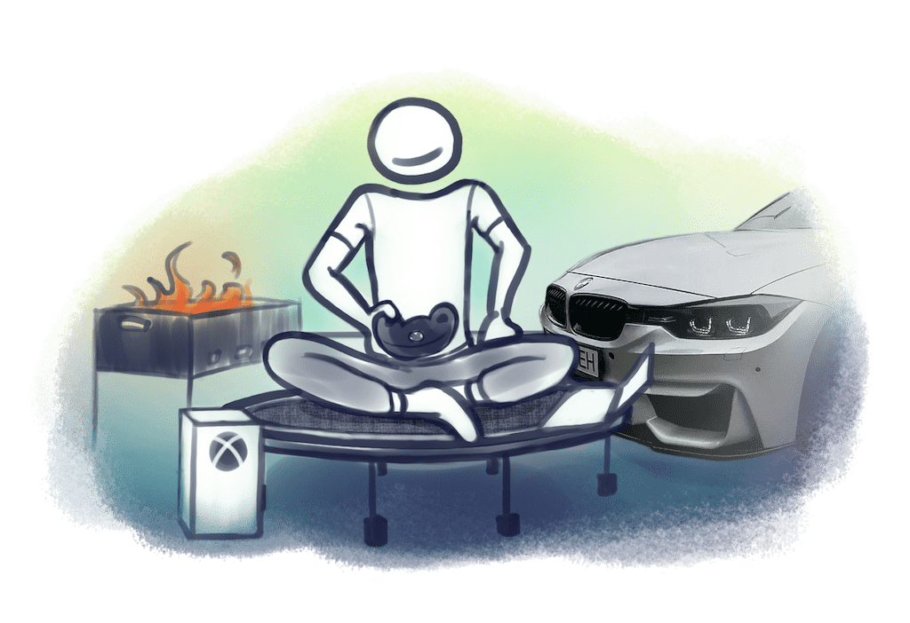
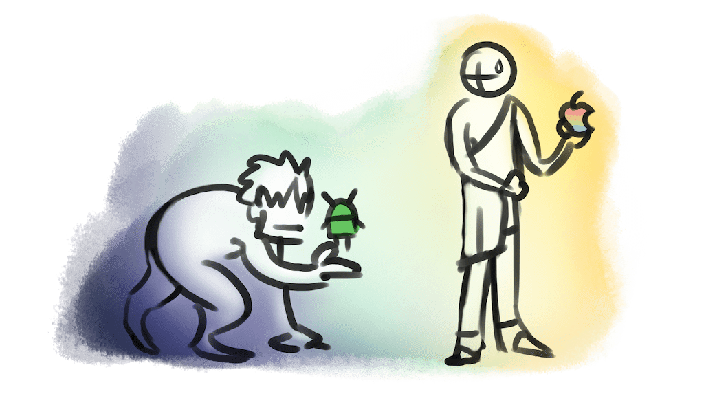

# Материальное

Речь в разделе пойдет о материальном имуществе

> Идея раздела заключается не в том, чтобы перечислить мое имущество, а в том, чтобы перечислить важные для меня вещи, о которых мне есть что сказать, возможно, неожиданного

Зашкварная страница. Напишу ее один раз и наверное не буду дополнять. Я уже бомж + жизни не хватит 🫢

## Батут

Выглядит странно, когда взрослый чувак ~~прыгает~~ пружинит на маленьком круглом батуте посреди комнаты. Друзья часто удивляются, как я умудряюсь делать это ПОСТОЯННО, иногда даже до 6 часов за раз и даже в процессе приема ~~пива~~ пищи. Ну, это лучше, чем просто трясти ногой (вредная привычка), либо ломать пружины в мебели (было и такое). К тому же батут частично заменяет ходьбу, помогает расслабиться и подумать о сложной задачи.

## Apple

### iPhone

Телефон это вещь, которая в современном мире почти всегда с нами. **Мы ближе к телефону чаще, чем даже к личному жилью,** поэтому несмотря на его цену, для меня разумнее 1 раз на много лет купить более дорогой, но хороший телефон, ~~чем 4 месяца жить в квартире~~.

> Мне пофиг, андроид у человека или ios, главное чтобы не андроид 🔥

Кстати, ловите дровишек 🔥😡. Я не буду топить конкретно за iPhone, но назову несколько своих наблюдений:

1. Я не знаю ни одного человека, который имел бы один из последних iPhone и вернулся бы на Android. Хоть такие конечно и есть. Зато знаю не меньше десятка, кто перешел на iPhone.
2. iPhone хейтят те, у кого его нет. Обычно это финансовые причины, либо принципиальная упертость (Привет, Валера)
3. С 2016 года (по текущий 2024 почти 8 лет) у меня было 2 телефона: iPhone 7 и iPhone 12. С 2013 по 2016 (три года) – три андроида. Наблюдаю это и за другими людьми.

### MacBook

Посрались и хватит. Теперь про ноуты. Даже сильные iPhone хейтеры любят MacBook. А кто не любит, тот слабый 🤭.

Как-то я писал, что первые пару месяцев после покупки MacBook я использовал его бесконечным количеством разных способов:

- Работал им как подставкой под бутерброды.
- Его великолепный экран офигенно показывал 1080p видео на ютюб.
- Аккумулятор превзошел все ожидания, потому что работал месяц без подзарядки. Выключенным.
- Переход привычек с Windows на Mac был быстр, как моя машина. После того, как друг ее разбил.

Да, я не особо его любил в первое время, но сейчас жалею, что не продал почку и не купил его раньше, потому что к текущему моменту я бы сэкономил гораздо больше времени на выполнении различных задач, чем стоит моя почка.

**Mac это:**

- Возможность работать на одном устройстве в любом месте дома или даже мира. Ты не привязан к компу, можешь работать с любой комнаты или на даче возле мангала
- Забытый дома блок питания, потому что ты забыл, что достал его из рюкзака, потому что мак долго не требует зарядки (пару дней в умеренном режиме)
- Экран 2560×1600px, который по физическому размеру в три раза меньше, чем твой 1920x1080p моник. Плотность и качество пикселей зашкаливает. После него пришлось купить себе 4k монитор с размером как типичный 2k, чтобы не блевать от размера пикселя и картинки в целом
- Когда тебе уже не нужен двухметровый монитор, чтобы эффективно выполнять задачи. Потому что в итоге ты учишься хоткеям, спейс менеджменту и минимализму
- Наличие CleanShotX – лучший, но при этом простейший скриншотер в мире, в котором я даже рисовать инфоштуки умудряюсь.
- Наличие Raycast – когда ты делаешь свои основные задачи не прикасаясь к тачпаду/мышке. Я бы записал вам демку, как например пишу пост в блог, а через 3 секунды у меня уже запущен сайт с гей порно, на котором я уже нашел видео, авторизировлся, проскипал до лучшего момента, лайкнул и при этом даже не прикасался к тачпаду. Кстати у меня сейчас открыто 23 окна
- Много чего еще сказать можно, лучше читать в разделе про Mac

### Apple Watch

Дно. Сначала прикольно, но потом не понимаешь зачем они тебе. И все равно хочешь их.

## xBox vs PlayStation

Не знаю, почему я думал, что буду играть xBox, раз у меня была плойка, в которую я тоже не играл, но да, было у меня и то и то. И если бы я был геемером, то купил бы себе xBox:

1. У xBox намного [более щедрый геймпас](https://www.xbox.com/ru-RU/xbox-game-pass/games).
2. В xBox ты можешь "читерить" с ценами, пользуясь геймпасом и платными играми почти бесплатно.
3. Но даже при равных условиях цены на игры в xBox все равно ниже, чем на PS
4. В xBox Series X, который у меня был, железо более мощное, чем в вышедшей в то же время PS5. Чувствительно мощнее
5. У xBox убогий, несимметричный, мерзкий, тошнотный, хрустящий, огромный, ужасный геймпад. И купить симметричный вы не сможете.
6. В геймпаде по умолчанию нет аккума, покупай отдельно. Но держат батарейки и аккум в 10 раз дольше, чем на PS и мысли "купить станцию" быстро пропали
7. Недавно узнал, что можно подключить клаву и мышку и играть, как на компе, но без компа. Не успел толком затестить, но теперь думаю про то, чтобы продать комп, ведь для работы я его все равно перестал использовать

## PC

После появления xBox и MacBook перестал использоваться. Игры почти не играю, а что играю, то на xBox. А работа намного удобнее с мака делается. Мощнее и портативнее и картинка приятнее.

Монитор, клаву, мышку и т.д. советую выбирать через [rtings.com](https://www.rtings.com), а не отзывы в магазинах. Rtings делает полноценные анализы каждого устройства и иногда среди дешевых устройств можно найти золотце.

Кстати, если планируете подключать мак к монитору, то 2к моники заставят вас рыгать от плотности пикселей, потому что у вашего мака с маленьким экраном разрешение в 2 раза выше, чем у вашего огромного монитора. Короче покупайте 4k моник, причем с плотными пикселями. Я брал [LG 27UP850](https://www.displayspecifications.com/en/model/72b2254f), там USB C выход, который сразу мак заряжает и картинку хорошую дает.

## TV

[LG C2 OLED](https://www.rtings.com/tv/reviews/lg/c2-oled). Выбирал по сайту rtings (всем советую для объективного выбора чего-либо).

Я пару лет назад:

> Вообще, я не смотрю ТВ, зато смотрю на людей, которые на черную пятницу тащат большую коробку как на обезьян.

Теперь я сам такой и купил зомбоящик. Этот TV:

- Может выступать в качестве дополнительного экрана (подключаюсь по AirPlay и вывожу туда что-то)
- Не злит, как меня злил дешевый xiaomi
- Не светится в темноте (oled)
- Он умный, подстраивает звук и картинку под окружающую среду
- Он хорошо дружит с AirPlay и внешними устройствами, например приставками Apple TV или Xbox
- На нем пульт с гироскопом, это крутяк
- Он впервые дал мне кайфануть от фильмов вечером
- И на нем очень крутой звук и картинка для игры в батлу. Аж дух захватывает

Всего этого не даст Xiaomi или HiSense. И я теперь остался совсем без почек, зато с ТВ, который будет радовать меня долгие годы.

## BMW F30 (2014)

Люблю ее и ненавижу. Ломается больно. Или просто я бомж (да). Но пока не тревожит – сплошной кайф. Когда говорю про продажу, то друзья расстраиваются. Писал о ней пару постов [вот тут](/bmw-1) и [тут](/bmw-2).

Вообще, люблю отвечать на вопросы о ней, так что задавайте, если хотите. Она многое пережила. Недавно например новое ДТП. Уже восстановили.

## Дачное

- Переносной тяжелый магнал – крутая штука.
- Гамак на дерево не оч. Прикольно первые пару дней, а дальше просто висит.
- Сделали качелю из сидения из машины. Прикольно редко, но регулярно. И в 100 раз круче обычной.
- Шалаш сдувает, если не вкопать. А в целом штука прикольная

## Кальянное

- С 2018 по 07.2024 курил по 4 кальяна каждый день
- Примерно 2 тыс дней, 8 тыс кальянов, 200+ кг табака
- [Вот тут](https://vas3k.club/post/4058/) писал как делать калик дома
- Хотел открыть свою кальянку
- Имел 5 кальянов дома и десятки кг табаков
- Планировал даже сам табаки варить.
- Полезная штука, чтобы курить дома: [очиститель воздуха](https://blog.amd-nick.me/hookah-air-purifier)
- Любимый производитель кальянов: Karma. Потом Maklaud, затем Hoob или xHoob, не помню
- Избегаю альфа хука, мамай хука, ненавижу amy delux, палица, эмбери и халил мамун.
- Табаки Darkside был хорош, но приелся. В итоге начал курить просто дешевые табаки и норм. Немного мешая с Tangiers берли.

## Бытовое

- Измельчитель отходов в раковину имба. В мусорке не воняет, можно хоть 200 пакетов дома держать
- Нагнетатель давления воды в системе работает ужасно на 4 этаже
- Посудомойка – имба
- Сувид и вакууматор – крутое, но у меня быстро сломалось
- Мультиварка – жил на даче больше года без плиты. ВСЕ делалось там. Плита при мультиварке не нужна.

----

Писал с лету. Мог что-то забыть. Картинки например. Хотите картинок? Дайте знать, прицеплю!
