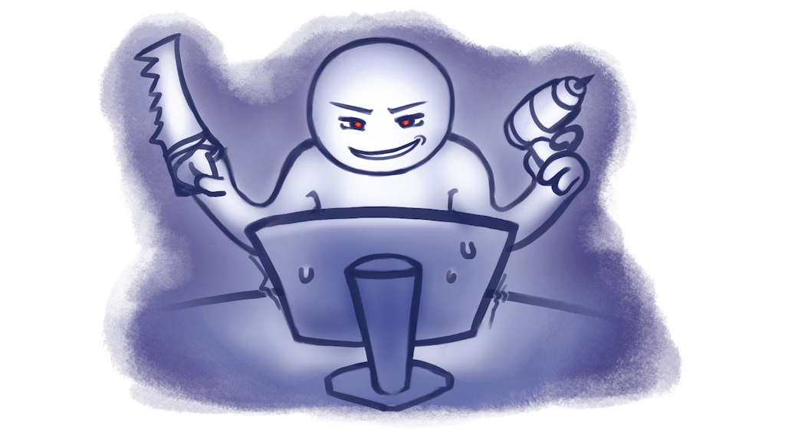

# 🪄 Разработка

> 💭 Чем меньше знаешь, тем сильнее тебе кажется, что ты самый умный &copy;

- **В приоритете простота поддержания кода**. Оптимизация и плюшки должны делаться по мере необходимости
- **Сначала планируй, потом делай**. Чтобы не бьло 100 переписей и рефакторингов
- Фичи делать при необходимости, а не желании
- **Делать минимум ради максимума**. Не нужно делать из продукта кухонный комбайн, если это просто нож

import DocCardList from '@theme/DocCardList';

<DocCardList />
