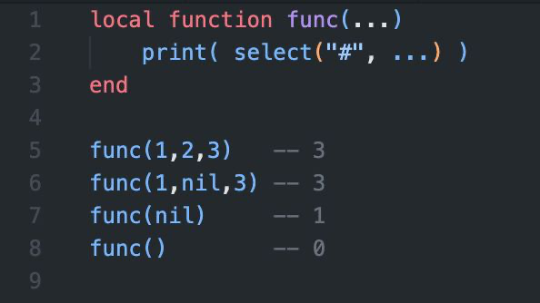

# Заметки

## nil не то же, что отсутствие значения

Поэтому если вы встретите в каких-то функциях `return nil`, то не спешите удалять эту строку. Возможно, она там не просто так

Например `tonumber(nil)` вернет nil, а `tonumber()` (без nil) вызовет ошибку

Проверить что nil это действительно nil, а не отсуствие аргумента в функции можно вот так: `select("#", ...)`. Функция вернет 1, если в параметрах передан nil и вернет 0, если ничего не указано

