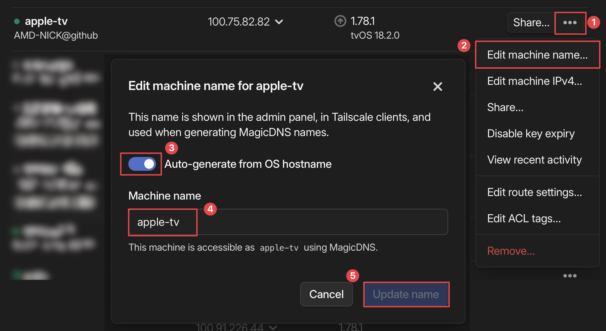
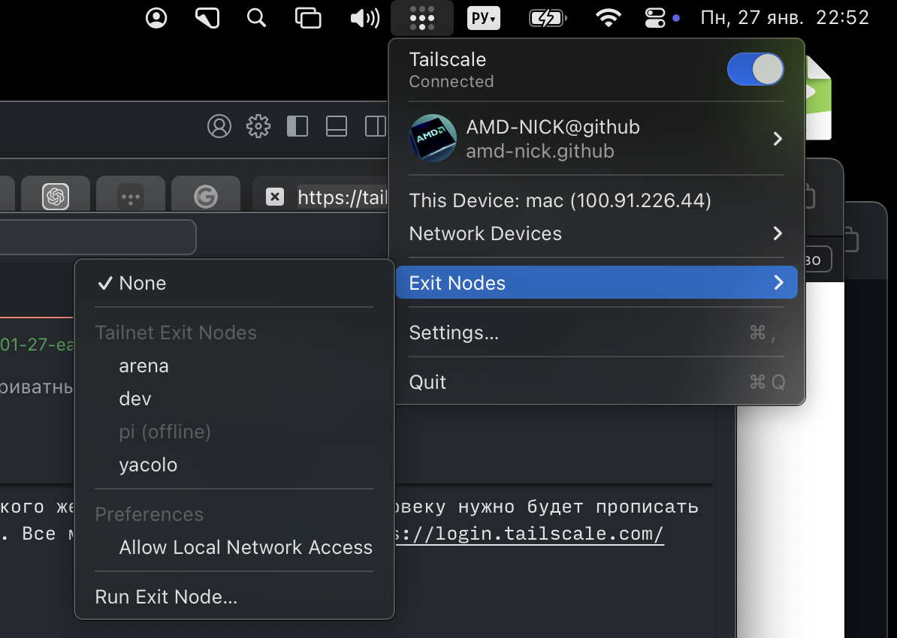
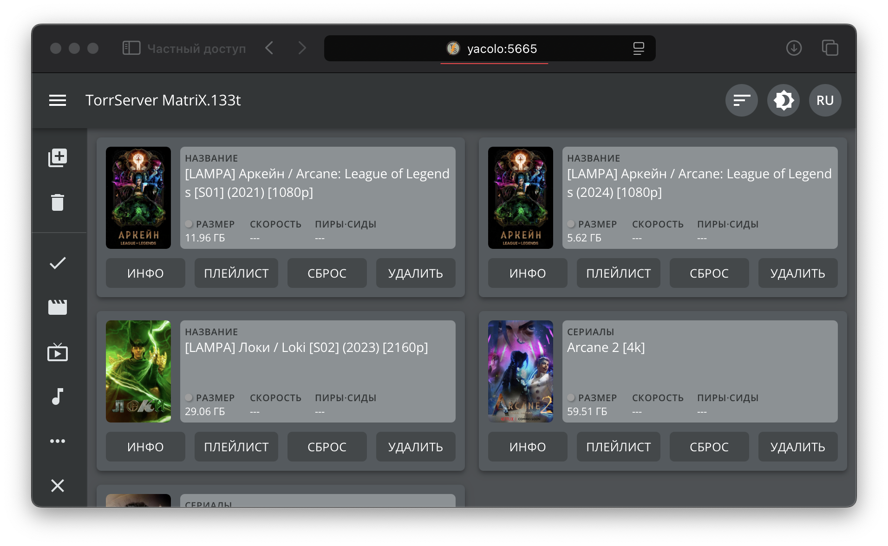

# Tailscale

> Tailscale это решение для создания VPN сетей без какой-либо обязательной конфигурации по принципу "установил и забыл".

## Советы, фишки, способы применения

### 🔥 SSH без пароля и возни с приватным ключом

Обожаемая фишка Tailscale. Написал отдельный пост в блоге на этот счет. Почитать можно тут: [клик](/2025/01/27/easy-ssh-with-tailscale).

### Красивые хостнеймы

После добавления устройства ему назначается автоимя. Оно обычно неудобное. На [главной странице](https://login.tailscale.com/admin/machines) смените имя на удобное, например dev, prod, nas, services, databases. `ssh me@db` ведь удобнее, чем `ssh me@hetzner-ubuntu-16-04`, huh?

:::info
Если вы расшарите кому-то хост, то для такого же удобного `ssh user@db` человеку нужно будет прописать на странице DNS адрес вашего Tailscale Network. Все можно найти тут: [клик](https://login.tailscale.com/admin/dns) (tailnet name, search domains)
:::

### VPN, как все привыкли

Так сложилось в мире, что под словом VPN все представляют штуку, которая просто "меняет IP". Tailscale это тоже умеет и называется это exit node. Это режим, при котором устройство выступает в качестве "выходной ноды", т.е. весь трафик будет "выходить в интернет" через нее, т.е. "менять ваш ип".

По умолчанию сервер не будет настроен для использования в качестве exit node. Нужно к `tailscale up --ssh` добавить `--advertise-exit-node`, а еще прописать пару строк в `/etc/sysctl.conf`, либо в папке `/etc/sysctl.d`. Про "пару строк" поищите на этой странице: [тыц](https://tailscale.com/kb/1103/exit-nodes?tab=linux#advertise-a-device-as-an-exit-node) (оно под спойлер спрятано).

:::info Сгорает заряд телефона!1!11 👿
На телефе у меня 24/7 включен Tailscale, но к exit node я подключаюсь только по необходимости, так как этот режим неизбежно подсаживает батарею, как и любой другой VPN. Я к тому, что сам Tailscale можете не вырубать для сохранения аккума. Достаточно вырубить подключение к exit node.
:::

### ip:port? А может dev:port?

Актуально для разработчиков веб сервисов и тех, кто любит щупать docker. Просто вместо ip:port в строке браузера для открытия сервиса можете писать devicename:port, где devicename это имя девайса в Tailscale, на котором вы запустили веб сервис.

:::info P.S.
Мне еще это не пригодилось, но вроде еще как замену ngrok, вернее CloudFlare Tunnel используют Tailscale Funnel
:::

### Локальная дистанционная игра

Люблю поиграть в нарды, покер и деберц с друзьями через приложение CardGames на телефон. При создании сетевой игры приложение показывает баннер в стиле "Скажите друзьям нажать 'Игра по WiFi' и ввести 192.168.1.15". Но я попал в больничку: Wifi нет, друзья сидят дома. Сказал всем скачать Tailscale, дал доступ к Tailnet, дал всем Tailscale IP своего телефона и игра даже не заметила подвоха, что мы в одном WiFi сидим. Мне кажется, даже автор игры такого не ожидал.

### Получаем доступ к камерам/принтерам, словно они в локальной сети

На пальцах: у меня есть дом. В доме есть IP камера и комп. Они в одной Wi-Fi сети.

Камера в локальной сети доступна по адресу `192.168.1.10:554`, но из интернета недоступна, потому что провайдер выдает "серый IP". Проброс портов в роутере не помогает, покупка белого IP – помогла (но я не хочу за него платить)

Также есть Linux сервер в другой стране, на котором установлен iSpy для просмотра этой камеры

Вот как это выглядит на пальцах:

**Задача – сделать камеру доступной с Франции без покупки "белого IP"**

**Потребуется** всегда включенный комп в одной WiFi сети с камерой (подойдет Raspberry Pi) и установленный на нем TailScale. Можно извратиться и попробовать установить Tailscale на роутер, но так получится сделать с очень немногими роутерами

Итак, камера на `192.168.1.10:554`. Подсеть `192.168.1.0/24`

1. Если комп на Linux (raspberry pi например), то [нужно включить IP Forwarding](https://tailscale.com/kb/1019/subnets/?tab=linux#enable-ip-forwarding)
2. Делаем подсеть частью сети Tailscale: `sudo tailscale up --advertise-routes=192.168.1.0/24` (без sudo, если windows)
3. В панели TailScale аппрувим подключенную подсеть в Machines
4. На нужном хосте, с которого нужен доступ к камерам делаем `sudo tailscale up --accept-routes`

Вуаля, камера доступна с далекого к камерам хоста по `192.168.1.10:554`
